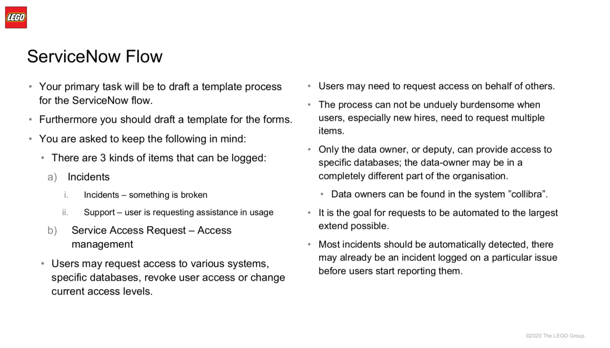
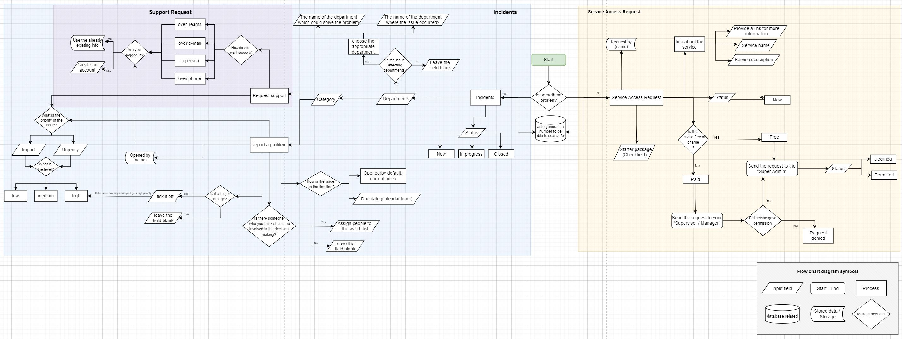

## Lego ServiceNow forms flow
### Case Study of Data Platform Operations Enablement team

# Case
Your primary task will be to draft a template process for the ServiceNow flow. Furthermore you should draft a template for the forms.

You are asked to keep the following in mind:
There are 3 kinds of items that can be logged:

* Incidents
  * Incidents – something is broken
  * Support – user is requesting assistance in usage

* Service Access Request – Access management

### Forms flow
[Flow chart diagram in draw.io](https://drive.google.com/file/d/1jpb90bWlvEtXh-S46Wm_USDrwOQwK-_I/view?usp=sharing)

