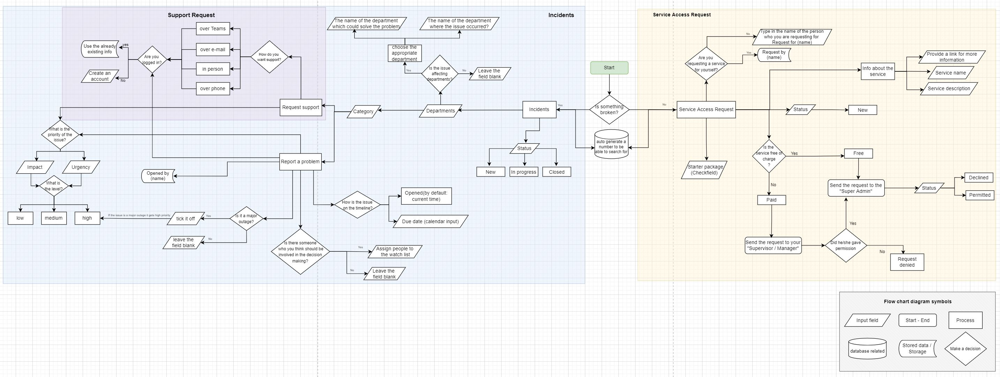

## Lego ServiceNow forms flow
### Case Study of Data Platform Operations Enablement team

# Case
Your primary task will be to draft a template process for the ServiceNow flow. Furthermore you should draft a template for the forms.

You are asked to keep the following in mind:
There are 3 kinds of items that can be logged:

* Incidents
  * Incidents – something is broken
  * Support – user is requesting assistance in usage

* Service Access Request – Access management

## A solution approach
### Forms flow chart in [draw.io](https://drive.google.com/file/d/1jpb90bWlvEtXh-S46Wm_USDrwOQwK-_I/view?usp=sharing)

### Interactive wireframe in [Figma](https://www.figma.com/file/XQwwj1t18GPsMxVKiXLbnt/Untitled?node-id=0%3A1) prioritising user experience.

### Key takeaways
* Learned about ServiceNow
  * Its purpose
  * How it should function developer's point of it.
  * how should the form be set up, it's flow chart as well as getting answers what fields should it incloud and why?
  * Understanding access permissions and  issue reports
* The importance of UX design using Figma
* Planning a workflow  
* How to think as part of a big company

  
